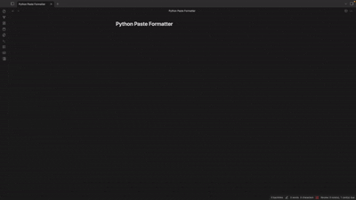

# Python Paste Formatter

Auto-format **Python** when you paste into a fenced block that declares Python (```python, ```py, ```python3).
It formats the *entire* code block after the paste using **Ruff** (`ruff format`) or **Black**.

<p align="left">
  <a href="https://buymeacoffee.com/onardin">
    
  </a>
</p>

## Motivation
Obsidian did not have a code styling plugin that supported auto-formatting for Python code. This specific solution redresses that.

### Before using Python Paste Formatter:
<p align="center">
  
</p>

### After using Python Paste Formatter:
<p align="center">
  
</p>

## Features
- Triggered only when the cursor is inside a fenced code block and the opening fence declares Python.
- Formats the whole fenced block after paste to avoid parse errors on partial snippets.
- Choose **Ruff** (default) or **Black**; configurable binary paths and line length.
- Desktop-only (uses Node's `child_process`).

## Requirements
- Either `ruff` (recommended) or `black` must be available on your system PATH, or set explicit paths in settings.

## Usage
- Paste inside a ```python fenced block. The plugin reconstructs the entire block, formats via stdin, and replaces the block.
- Settings:
  - **Formatter engine**: Ruff or Black
  - **Ruff path / Black path**
  - **Line length**
  - **Scope**: Whole block (safe) or only pasted snippet

## Submit to Community Plugins
- Fork and open a PR to [`obsidianmd/obsidian-releases`](https://github.com/obsidianmd/obsidian-releases).
- Add your repo to `community-plugins.json` and follow the PR checklist.
- Docs: Manifest fields and versions mapping:
  - https://docs.obsidian.md/Reference/Manifest
  - https://docs.obsidian.md/Reference/Versions
 
## Support
If this plugin saves you time, you can support development here:

**👉 [Buy me a coffee](https://buymeacoffee.com/onardin)**

## License
MIT
